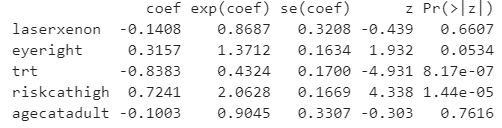

# Survival Analysis of Patients with Diabetic Retinopathy
---
## What is Survival Analysis?
Survival Analysis investigates the time it takes for an event to occur.

## Data Used
The data we used comes from R's *survival* package under *diabetic* dataframe,
which contains partial results from a trial of laser coagulation for the treatment
of diabetic retinopathy. Diabetic retinopathy is caused by damage to the blood vessels
of the retina, which can lead to blindness ([details](https://www.mayoclinic.org/diseases-conditions/diabetic-retinopathy/symptoms-causes/syc-20371611)). 

## Models and Methods Used
In our study, we are interested in finding out which parameters contribute to the patient blindness and which do not. We used three methods to identify those parameters:
- **Kaplan-Meier Curve**: shows the plot of the probability of the event (patient with diabetic retinopathy losing sight) at a certain time using a single binary categorical variable as shown below:   
 
  * At time zero, the survival probability is 1, which means that all of the patients have their vision.
  * From the plot we can see that **as the time approaches infinity**, the survival rate is approximately 50% for both Argon and Xenon groups, which means that **about 50% of patients** would **go blind** while the other 50% of the patients would remain their vision. 
  *  A vertical drop in the curves indicates an event, i.e. patients losing sight.
  *  The vertical tick mark on the curves means that a patient was censored at this time. For the purpose of our study, we did not use censored data.   
- **Log-rank test**: enables us to compare the survival curves of two or more groups. This test can only be used for a univariate analysis (similarly to Kaplan-Meier Curve)   
 
From this summary, we can observe two phenomena:
1). Data is not balanced between minor and adult groups
2). Because the p-value is so high, age category at which the diagnosis was received has no influence on how quickly patients with diabetic retinopathy lose sight.   
- **Cox Proportional-hazards model**:  evaluates how several factors, whether they are continuous or binary categorical, affect the rate of a particular event happening.   
 
In this case, we were able to take a look at all 5 variables: type of laser treatment, eye treated, whether treatment was received or not, risk category, and age category. 

## Key findings:
- It was discovered that whether or not a patient received treatment was significant. Those who received treatment were 57% less likely to lose vision as those who did not receive treatment
- Those patients who were in the high risk category were 106% more likely to lose vision as those who are in the medium group.

## Suggestion:
The age category group was not balanced as minors constituted 64% of the group and adults consituted the remaining 36%. The implementation of *ntile* would evenly distribute patients into two categories, which potentially can lead to different statistically significant results (i.e., age category might end up being significant). 

